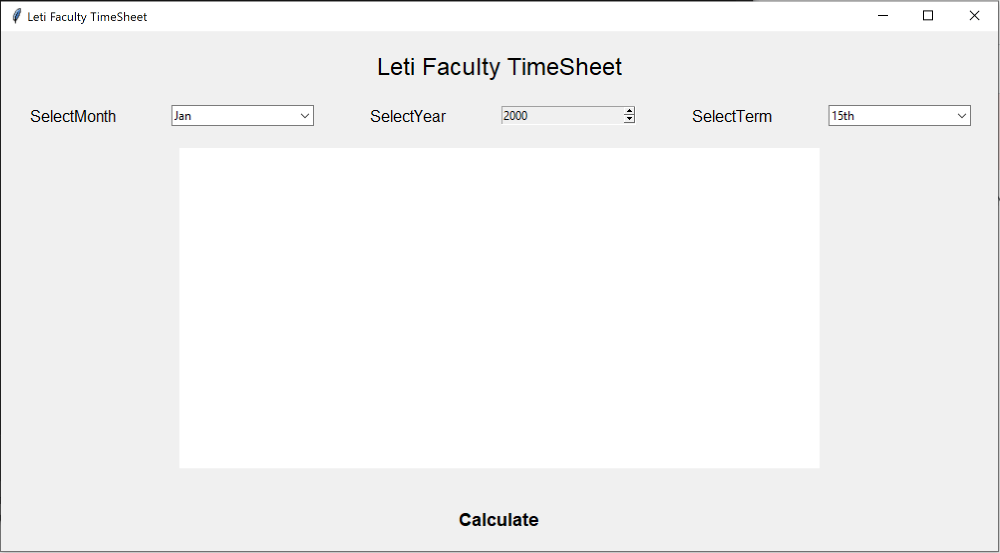
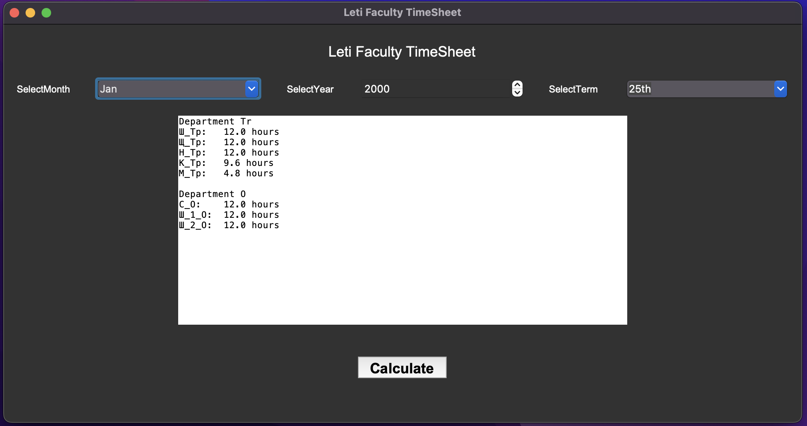
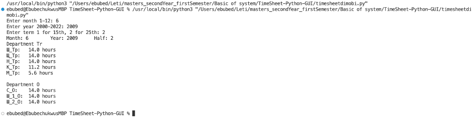

# Maual for TimeSheet-Python-GUI

## Quick Run using UserInterface on Windows using exe
1. Open the Executable folder on https://github.com/ebubedimobi/TimeSheet-Python-GUI/tree/main/Executable
2. double click on the calculatorApp.exe file
3. Select **Month**
4. Select **Year** (from 2000 to 2022).
5. Select **Term** of the month .
6. Click **Calculate** button. If the calculate button is missing, you need to adjust the size of the window
7. The **Result** will be shown in the text area.
## Screenshot

## How to run as GUI using code On MacOS or Windows
1. Open the folder https://github.com/ebubedimobi/TimeSheet-Python-GUI using VSCode or anyother python IDE
2. Open calculatorApp.py https://github.com/ebubedimobi/TimeSheet-Python-GUI/blob/main/calculatorApp.py and run the program
3. Select **Month**.
4. Select **Year** (from 2000 to 2022).
5. Select **Term** of the month .
6. Click **Calculate** button. If the calculate button is missing, you need to adjust the size of the window
7. The **Result** will be shown in the text area.
## Screenshot

## How to run as non-GUI using code On MacOS or Windows
1. Open the folder https://github.com/ebubedimobi/TimeSheet-Python-GUI using VSCode or anyother python IDE
2. Open timeSheet.py https://github.com/ebubedimobi/TimeSheet-Python-GUI/blob/main/timesheet.py and run the program
3. Enter **Month** from range of 1-12 (1 being January and 12 December).
4. Select **Year** (from 2000 to 2022).
5. Select **Term** of the month range of 1-2 (1 being first half of month, 2 - being second half).
7. The **Result** will be shown in the debug console.
## Screenshot

