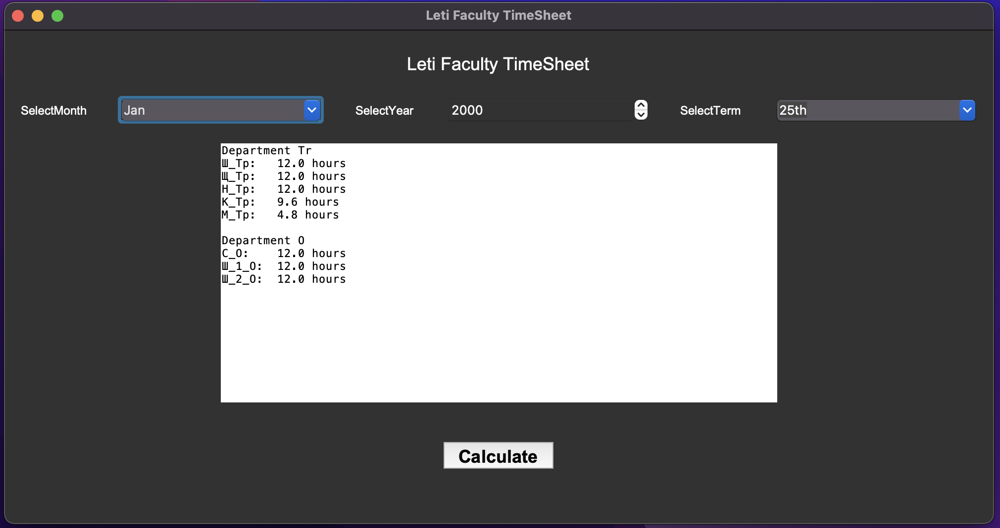

# TimeSheet-Python-GUI
## How to use On MacOS or Windows
1. Open calculatorApp.py and run the program
2. Select **Month**.
3. Select **Year** (from 2000 to 2022).
4. Select **Term** of the month .
5. Click **Calculate** button.
6. The **Result** will be shown in the text area.

## Quick Run on Windows using exe
1. Open the Executable folder
2. double click on the exe file
## Screenshot

